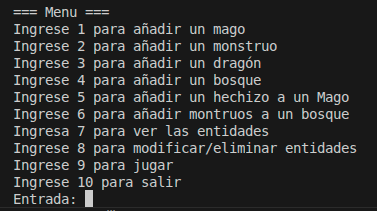
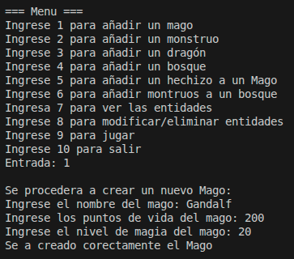
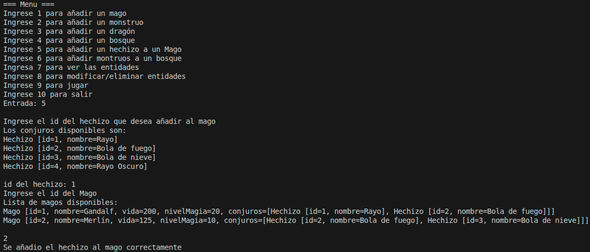
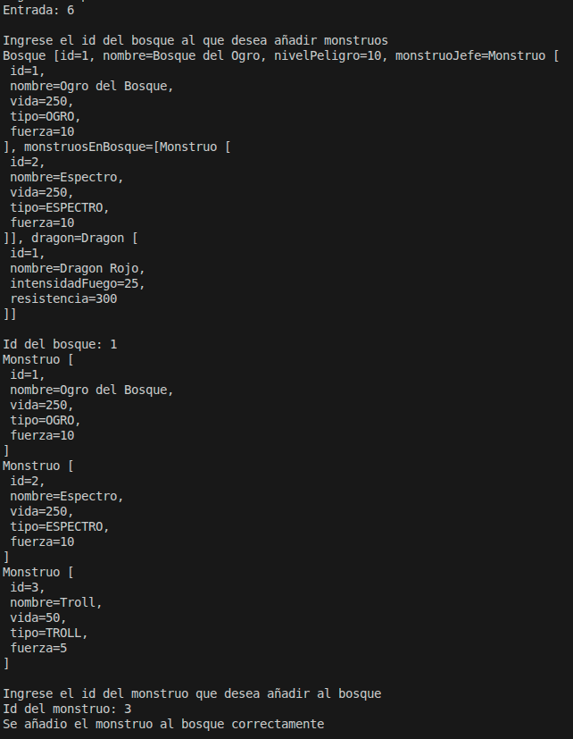
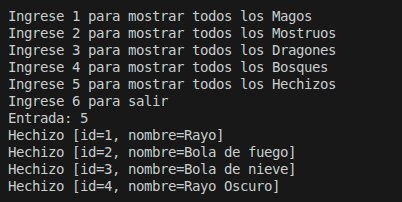
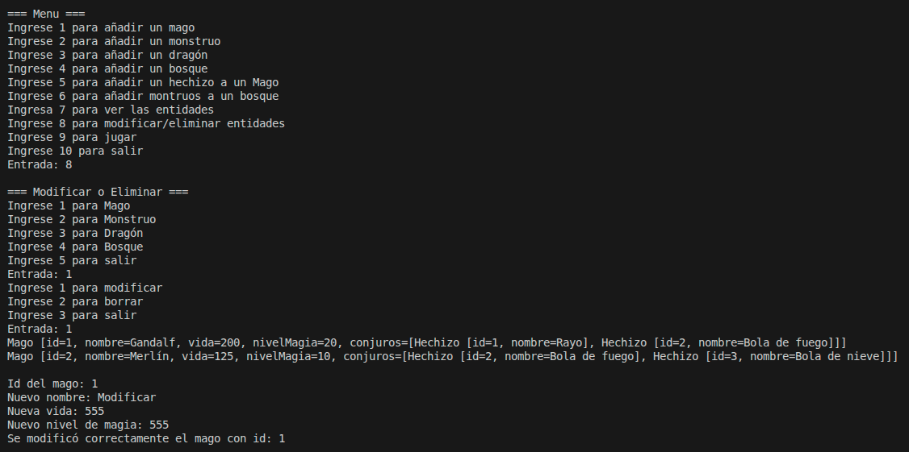
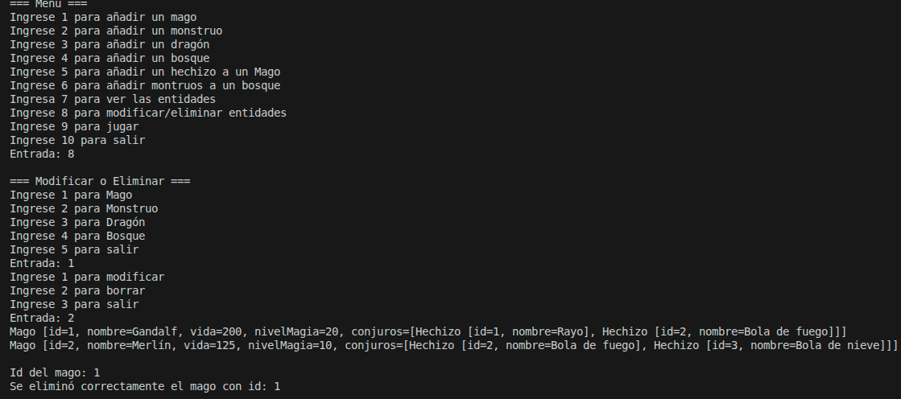
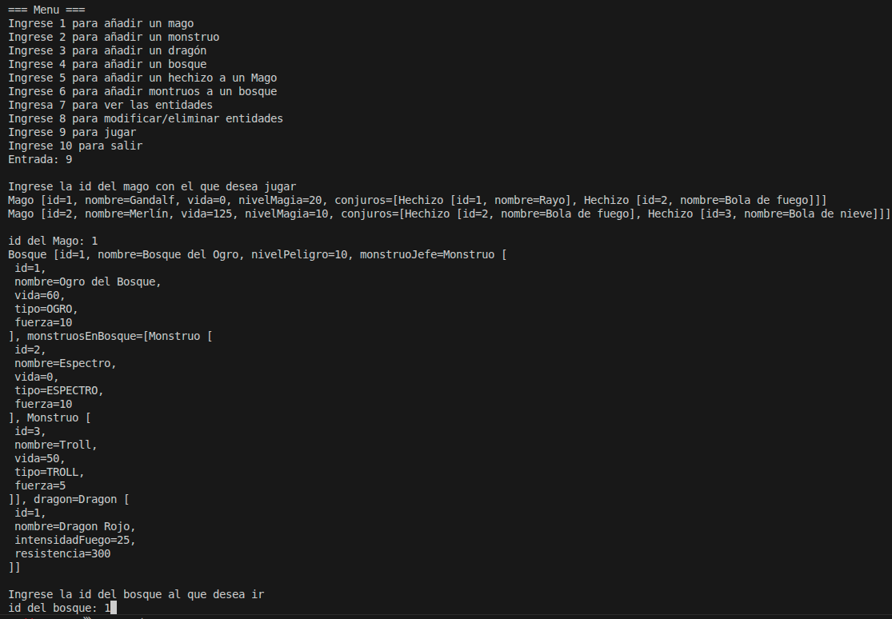
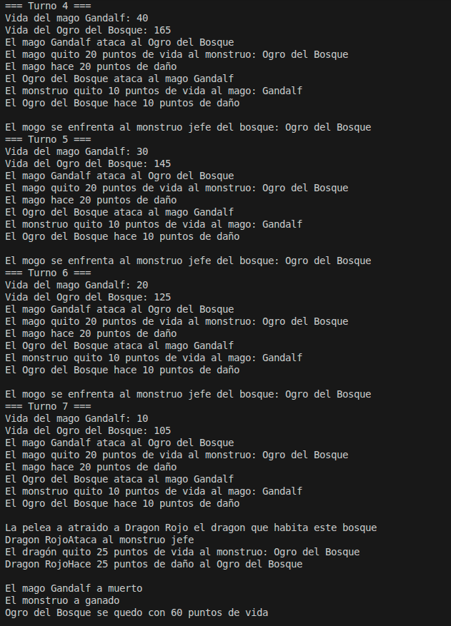

# Manual de Usuario de Dragolandia

Este manual explica como usar la aplicacion dragolandia

## Indice
1. Introducion
2. Crear entidades
3. Añadir un hechizo a un mago
4. Añadir un monstruo a un bosque
5. Ver las entidades creadas
6. Modificar o borrar entidades
7. Jugar

### Introducion
Dragolandia tiene integrado un menu con 10 opciones que facilitan el uso de la aplicacion

### Crear entidades

Las opciones del menu 1 a la 4 permiten crear entidades. Durante la creacion de una entidad te pedira que rellenes los campos de la entidad (vida, nombre...)

#### Ejemplo de creacion de mago
Al selecionar la creacion de mago (opcion 1) te pide que ingreses los datos que tengra el mago en este caso nombre, vida y nivel de magia del mago, al ingresar el ultimo dato se creara el mago de forma automatic y se guardara en la base de datos.

### Añadir un hechizo a un mago
Para añadir un hechizo al mago tendras que selecionar la opcion 5 del menu. Al seleccionar esta opcion te mostrara la lista de hechizos disponibles y para seleccionar el hechizo que deseas añadir tendras que ingresar su id.
Despues te mostrara la lista de magos y tendras que ingresar la id del mago al que quieras añadirle el hehizo.

### Añadir un monstruo a un bosque
Para añadir un monstruo a un bosque debe seleccionar la opcion 6, al seleccionar esta opcion te mostrara todos los bosques disponibles y bebera ingresar la id del bosque para seleccinarlo. Despues te mostrara todos los monstruos disponibles donde seleccionara el que desea añadir ingresando la id.

### Ver las entidades creadas
Para ver las entidades creadas tendra que seleccioanr la opccion 7 despues tendra que seleccionar el tipo de entidad que desea comprobar (1 Mago, 2 Monstruo, 3 Dragon, 4 Bosque, 5 Hechizo, 6 para salir) despues de seleciona el tipo de entidad te mostrara todas las entidades de ese tipo que hay

### Modificar o borrar entidades
Para modificar o eliminar una entidad debe seleccionar la opcion 8, despues tendra que seleccionar el tipo de entidad que desea modificar o eliminar (1 Mago, 2 Monstruo, 3 Dragon, 4 Bosque, 5 para salir). Una vez selecionada debe seleccionar si va a modificar o eliminar la entidad (1 modificar, 2 eliminar, 3 salir).
Si seleciona modificar tendra que ingresar la id de la entidad que desea modificar y luego ingresar los datos de la entidad

Si seleciona borrar debera ingresar la id de la entidad que desea borrar y se borrara de forma automatica

### Jugar
Para jugar debera selecionar la opcion 9 donde te mostrara la lista de magos y bosques disponibles y tendra que ingresar la id del mago y el bosque con los que desea jugar:

Despues se ejecutara el juego un combate por turnos de forma automatica. Primero el mago se enfreta a un monstruo del bosque y se gana se enfrenta al monstruo jefe donde puede que aparezca un dragon a ayudar al mago:

Aqui hay un fragmento del combate contra el jefe donde em mago muere y ell dragon participa.

