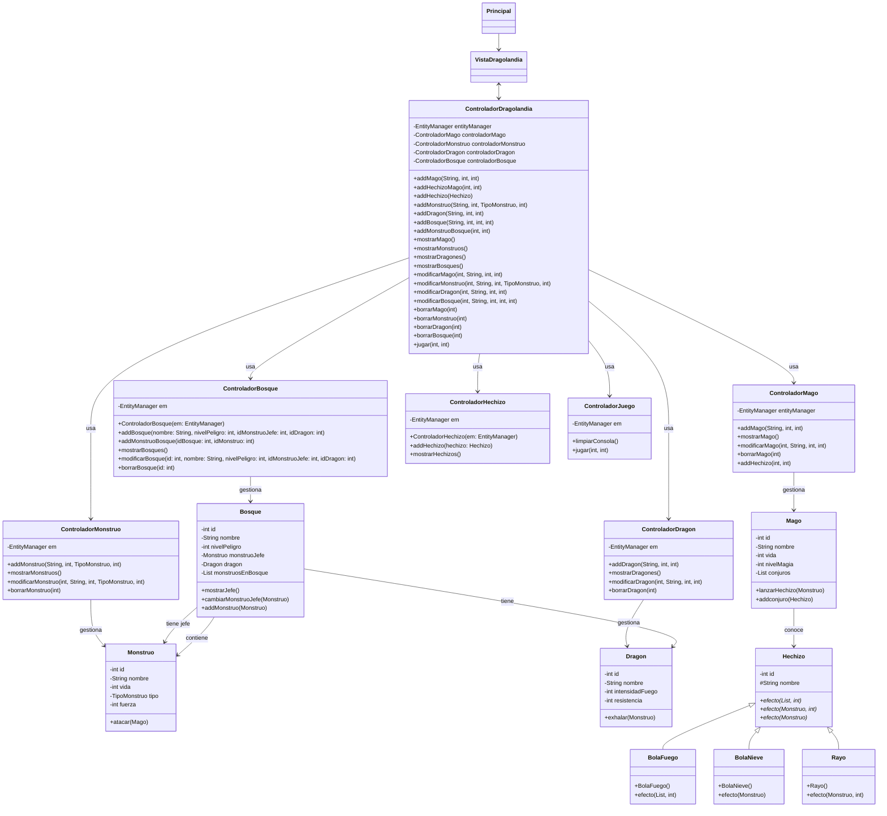

# Dragolandia

## Introduccion
Este esta es una aplicacion que permite añadir magos, dragones y monstruos para que combatan en un bosque

## Analisis
Dragolandia esta diseñada siguiendo el patron modelo-vista-controlador
El sistema te permite crear magos, monstruos, dragones y bosques para luego usarlo en una simulacion de combate

A los magos puedes darles nombre, personalizar sus atributos y añadirles hechizos
A los monstruos puedes darles nombre, escoger su tipo y personalizar sus atributos
A los dragones puedes darles nombre y personalizar sus atributos
A los bosques puedes darle nombre, escoger el mostruo jefe del bosque, seleccionar el dragon que habita en el bosque y añadir monstruos al bosque
Puedes ver, modificar y eliminar las entidades
Al jugar selecionas un mago y un bosque donde combatiras contra un monstruo y luego contra el jefe donde el dragon puede aparecer a ayudar.

### Manual
[Manual de Dragolandia](./Manual.md)

### Ampliación
Se podria ampliar el juego permitiendo que el usuario cree sus propios hechizos y permitiendo al mago tener invocaciones que serian monstruos amistosos que el mago podria invocar en battala para que le ayuden

### Diagrama de clases

## Diseño

#### Diagrama entidad relacion

```mermaid
erDiagram

    MONSTRUO }o--|| TIPO_MONSTRUO : "es de tipo"

    BOSQUE ||--o| MONSTRUO : "Es jefe"
    BOSQUE ||--o{ MONSTRUO : "Esta"
    BOSQUE ||--o| DRAGON : "Esta"
    
    MAGO ||--o{ HECHIZO : "conoce"

    HECHIZO ||--|{ BOLA_FUEGO : "Hereda"
    HECHIZO ||--|{ BOLA_NIEVE : "Hereda"
    HECHIZO ||--|{ RAYO : "Hereda"
    
    BOSQUE {
        int id PK
        string nombre
        int nivelPeligro
        int monstruoJefe_id FK
        int dragon_id FK
    }
    
    DRAGON {
        int id PK
        string nombre
        int intensidadFuego
        int resistencia
    }
    
    MAGO {
        int id PK
        string nombre
        int vida
        int nivelMagia
    }
    
    MONSTRUO {
        int id PK
        string nombre
        int vida
        string tipo
        int fuerza
    }
    
    TIPO_MONSTRUO {
        string tipo
    }
    
    HECHIZO {
        int id PK
        string nombre
    }
    
    BOLA_FUEGO {
        int id PK
    }
    
    BOLA_NIEVE {
        int id PK
    }
    
    RAYO {
        int id PK
    }
```

